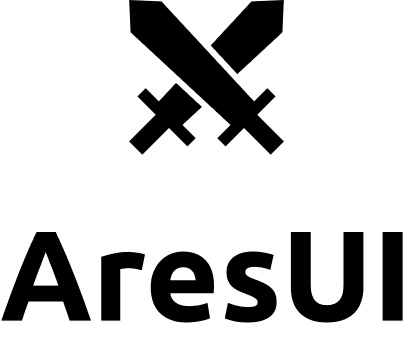

<p align="center">
      
</p>

<!-- <br /> -->

<p align="center">
  <!--  -->

  

  

  <!-- <a href="https://www.linkedin.com/in/jeffersoncalmon/">
    
  </a> -->

  <a href="https://github.com/jefferson-calmon/aresui/commits/master">
    
  </a>

  

  

   <a href="https://github.com/jefferson-calmon/aresui/stargazers">
    
  </a>
</p>

<p align="center">
  <a href="#project">Projeto</a>&nbsp;&nbsp;&nbsp;|&nbsp;&nbsp;&nbsp;
  <a href="#install">Instalação</a>&nbsp;&nbsp;&nbsp;|&nbsp;&nbsp;&nbsp;
  <a href="#use">Uso</a>&nbsp;&nbsp;&nbsp;|&nbsp;&nbsp;&nbsp;
  <a href="#docs">Documentação</a>
</p>

<br />

> 🚧 Este projeto ainda está em desenvolvimento, isso quer dizer que pode ter bugs e quebras em alguns componentes.

<a id="project"></a>
# AresUI

AresUI é uma biblioteca de componentes para aplicações Next.js, projetada para facilitar o desenvolvimento de interfaces de usuário bonitas e responsivas. Com uma ampla gama de componentes reutilizáveis e personalizáveis, AresUI permite que você crie rapidamente interfaces modernas e elegantes.

## Características Principais

-   **Componentes Reutilizáveis**: AresUI oferece uma variedade de componentes reutilizáveis prontos para uso, como botões, formulários, cards, navegação, entre outros. Esses componentes podem ser facilmente integrados em sua aplicação Next.js, economizando tempo e esforço no desenvolvimento.

-   **Design Responsivo**: Todos os componentes do AresUI são responsivos e se adaptam automaticamente a diferentes tamanhos de tela, desde dispositivos móveis até desktops. Isso garante uma experiência consistente e agradável para os usuários, independentemente do dispositivo que eles estejam usando.

-   **Customização Flexível**: Além dos estilos pré-definidos, você pode personalizar facilmente os componentes do AresUI para se adequarem à identidade visual de sua aplicação. Através de classes CSS ou props específicas, você pode ajustar cores, tamanhos, fontes e muito mais.

-   **Fácil Integração**: AresUI foi projetado especificamente para ser integrado em projetos Next.js. Ele se integra perfeitamente ao fluxo de desenvolvimento padrão do Next.js, permitindo uma instalação e uso simples.

<a id="install"></a>
## Instalação

Para começar a usar o AresUI em sua aplicação Next.js, você pode instalar o pacote npm utilizando o seguinte comando:

```
npm install aresui
```

ou

```
yarn add aresui
```

<a id="use"></a>
## Uso

Após a instalação, você pode importar os componentes do AresUI em seus arquivos JavaScript ou TypeScript:

```jsx
import { Button, Input } from 'aresui';

function MyComponent() {
    return (
        <div>
            <Input label="E-mail" name="email" role="email" />
            <Input label="Senha" name="password" role="password" />

            <Button>Entrar</Button>
        </div>
    );
}
```

Certifique-se de que sua aplicação esteja configurada corretamente para suportar o Next.js e seus requisitos de construção.


<a id="docs"></a>
## Documentação

Para obter mais detalhes sobre como usar os componentes do AresUI, consulte a [documentação completa](https://aresui-docs.vercel.app).

## Contribuidores

| [](https://github.com/jefferson-calmon) |
| --------------------------------------------------------------------------------------------------------------- |
| [Jefferson F. Calmon](https://github.com/jefferson-calmon)                                                      |

## Contribuição

Contribuições são bem-vindas! Se você encontrar algum problema, tiver alguma ideia ou quiser melhorar o AresUI, sinta-se à vontade para abrir uma [issue](https://github.com/jefferson-calmon/aresui/issues) ou enviar uma [pull request](https://github.com/jefferson-calmon/aresui/pulls) no repositório do GitHub.

## Licença

AresUI é licenciado sob a [MIT License](https://opensource.org/licenses/MIT).

---

AresUI é uma biblioteca em constante evolução e aprimoramento. Agradecemos pelo seu interesse e esperamos que você encontre valor ao usá-la em seus projetos Next.js. Se você tiver alguma

dúvida ou precisar de suporte, não hesite em nos contatar.

Para mais informações, visite o nosso website: [https://aresui.com](https://aresui.com)
